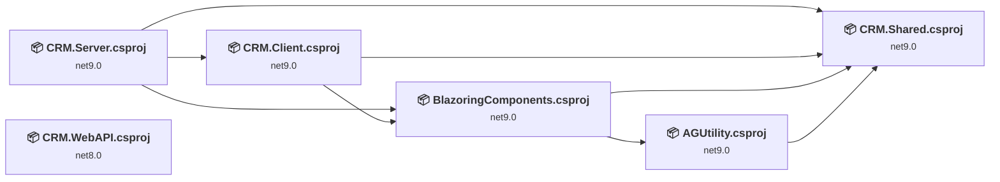
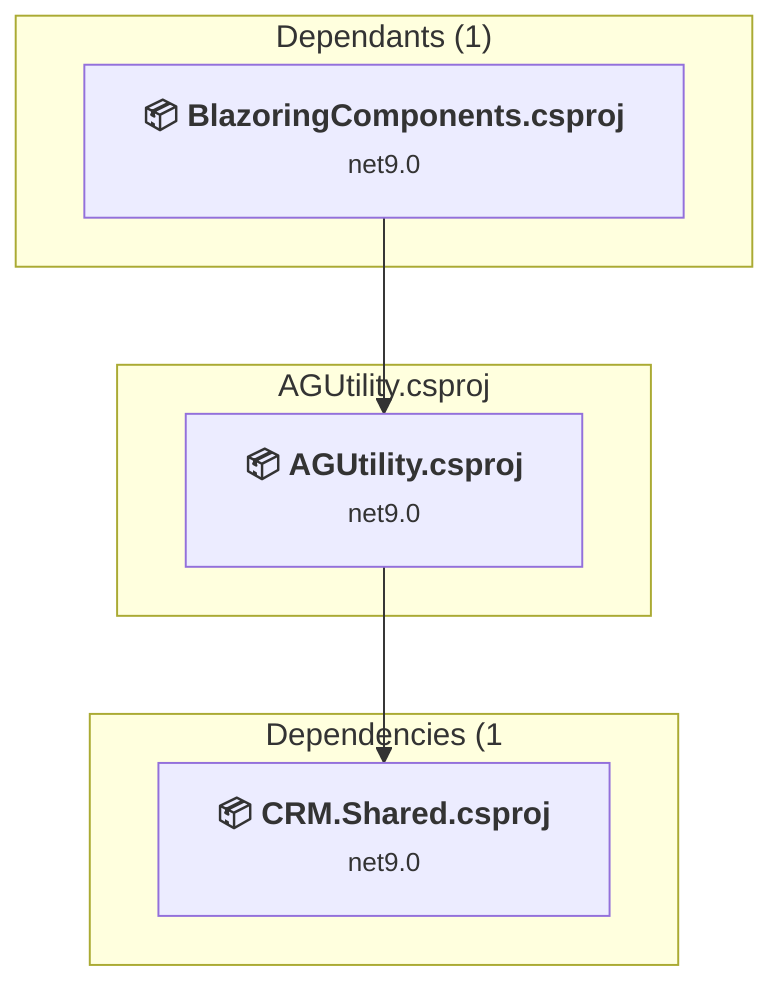
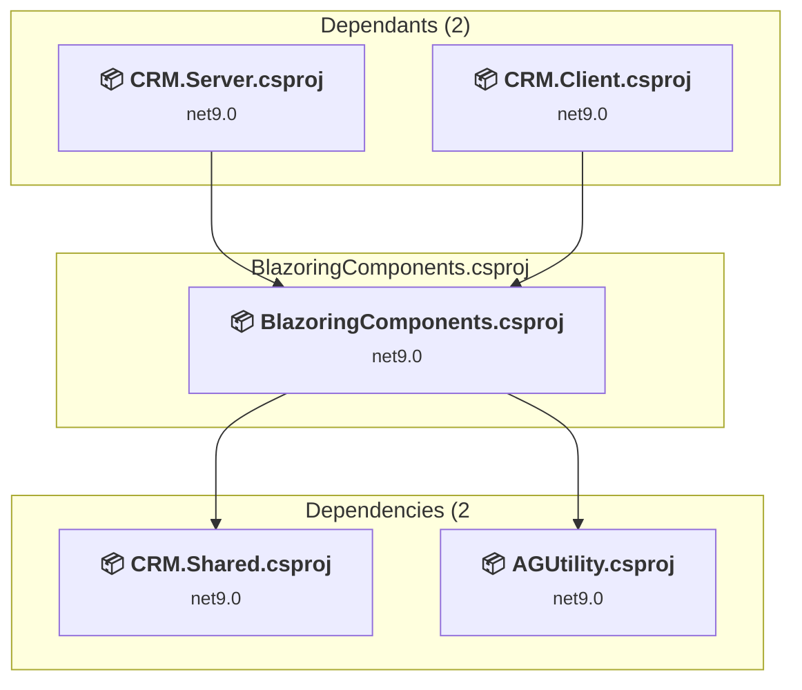
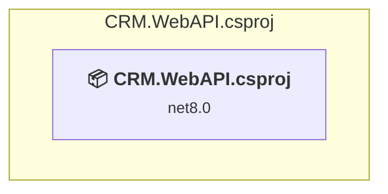
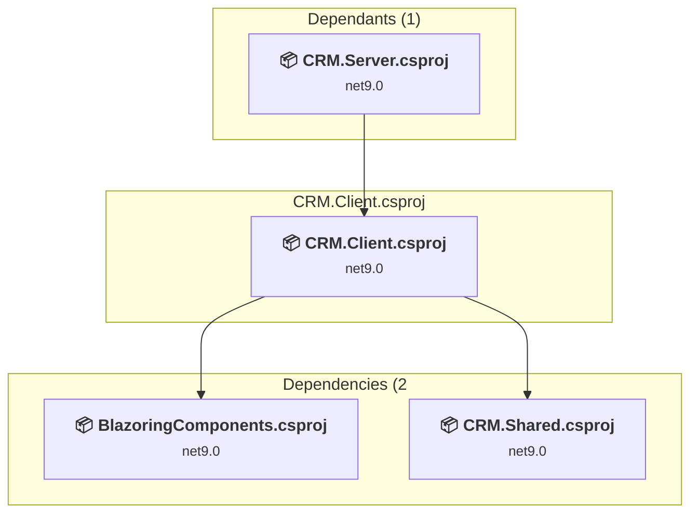
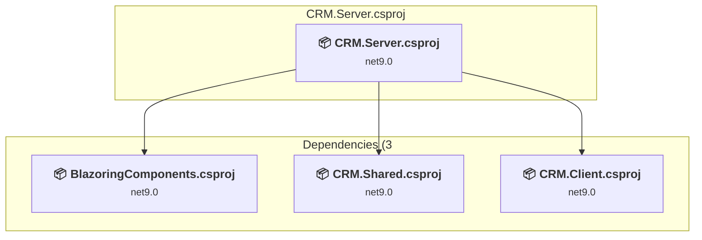
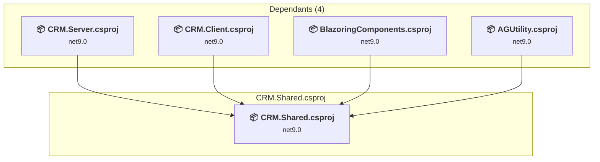

# Projects and dependencies analysis

This document provides a comprehensive overview of the projects and their dependencies in the context of upgrading to .NETCoreApp,Version=v10.0.

## Table of Contents

- [Executive Summary](#executive-Summary)
  - [Highlevel Metrics](#highlevel-metrics)
  - [Projects Compatibility](#projects-compatibility)
  - [Package Compatibility](#package-compatibility)
  - [API Compatibility](#api-compatibility)
  - [Binding Redirect Configuration](#binding-redirect-configuration)
- [Aggregate NuGet packages details](#aggregate-nuget-packages-details)
- [Top API Migration Challenges](#top-api-migration-challenges)
  - [Technologies and Features](#technologies-and-features)
  - [Most Frequent API Issues](#most-frequent-api-issues)
- [Projects Relationship Graph](#projects-relationship-graph)
- [Project Details](#project-details)

  - [AGUtility\AGUtility.csproj](#agutilityagutilitycsproj)
  - [BlazoringComponents\BlazoringComponents.csproj](#blazoringcomponentsblazoringcomponentscsproj)
  - [CRM.WebAPI\CRM.WebAPI.csproj](#crmwebapicrmwebapicsproj)
  - [CRM\Client\CRM.Client.csproj](#crmclientcrmclientcsproj)
  - [CRM\Server\CRM.Server.csproj](#crmservercrmservercsproj)
  - [CRM\Shared\CRM.Shared.csproj](#crmsharedcrmsharedcsproj)

## Executive Summary

### Highlevel Metrics

| Metric | Count | Status |
| :--- | :---: | :--- |
| Total Projects | 6 | All require upgrade |
| Total NuGet Packages | 65 | 29 need upgrade |
| Total Code Files | 1093 |  |
| Total Code Files with Incidents | 108 |  |
| Total Lines of Code | 384514 |  |
| Total Number of Issues | 313 |  |
| Estimated LOC to modify | 269+ | at least 0,1% of codebase |

### Projects Compatibility

| Project | Target Framework | Difficulty | Package Issues | API Issues | Binding Issues | Est. LOC Impact | Description |
| :--- | :---: | :---: | :---: | :---: | :---: | :---: | :--- |
| [AGUtility\AGUtility.csproj](#agutilityagutilitycsproj) | net9.0 | 🟢 Low | 8 | 0 | 0 |  | ClassLibrary, Sdk Style = True |
| [BlazoringComponents\BlazoringComponents.csproj](#blazoringcomponentsblazoringcomponentscsproj) | net9.0 | 🟢 Low | 3 | 1 | 0 | 1+ | ClassLibrary, Sdk Style = True |
| [CRM.WebAPI\CRM.WebAPI.csproj](#crmwebapicrmwebapicsproj) | net8.0 | 🟢 Low | 0 | 0 | 0 |  | AspNetCore, Sdk Style = True |
| [CRM\Client\CRM.Client.csproj](#crmclientcrmclientcsproj) | net9.0 | 🟢 Low | 12 | 190 | 0 | 190+ | AspNetCore, Sdk Style = True |
| [CRM\Server\CRM.Server.csproj](#crmservercrmservercsproj) | net9.0 | 🟢 Low | 12 | 74 | 0 | 74+ | AspNetCore, Sdk Style = True |
| [CRM\Shared\CRM.Shared.csproj](#crmsharedcrmsharedcsproj) | net9.0 | 🟢 Low | 3 | 4 | 0 | 4+ | ClassLibrary, Sdk Style = True |

### Package Compatibility

| Status | Count | Percentage |
| :--- | :---: | :---: |
| ✅ Compatible | 36 | 55,4% |
| ⚠️ Incompatible | 2 | 3,1% |
| 🔄 Upgrade Recommended | 27 | 41,5% |
| ***Total NuGet Packages*** | ***65*** | ***100%*** |

### API Compatibility

| Category | Count | Impact |
| :--- | :---: | :--- |
| 🔴 Binary Incompatible | 2 | High - Require code changes |
| 🟡 Source Incompatible | 32 | Medium - Needs re-compilation and potential conflicting API error fixing |
| 🔵 Behavioral change | 235 | Low - Behavioral changes that may require testing at runtime |
| ✅ Compatible | 677660 |  |
| ***Total APIs Analyzed*** | ***677929*** |  |

## Aggregate NuGet packages details

| Package | Current Version | Suggested Version | Projects | Description |
| :--- | :---: | :---: | :--- | :--- |
| Anthropic | 12.35.1 |  | [CRM.Server.csproj](#crmservercrmservercsproj) | ✅Compatible |
| Azure.AI.FormRecognizer | 4.1.0 |  | [CRM.Server.csproj](#crmservercrmservercsproj) | ✅Compatible |
| Azure.Identity | 1.13.1 |  | [CRM.Server.csproj](#crmservercrmservercsproj) | ⚠️Il pacchetto NuGet è deprecato |
| bootstrap | 5.3.3 |  | [CRM.Server.csproj](#crmservercrmservercsproj) | ✅Compatible |
| DateTimeExtensions | 5.11.7 |  | [CRM.Server.csproj](#crmservercrmservercsproj) | ✅Compatible |
| DocumentFormat.OpenXml | 3.2.0 |  | [CRM.Server.csproj](#crmservercrmservercsproj) | ✅Compatible |
| Faso.Blazor.SpinKit | 1.0.1 |  | [BlazoringComponents.csproj](#blazoringcomponentsblazoringcomponentscsproj) [CRM.Client.csproj](#crmclientcrmclientcsproj) | ✅Compatible |
| FluentValidation | 11.11.0 |  | [BlazoringComponents.csproj](#blazoringcomponentsblazoringcomponentscsproj) | ✅Compatible |
| Humanizer.Core | 2.14.1 |  | [CRM.Client.csproj](#crmclientcrmclientcsproj) | ✅Compatible |
| MailKit | 4.17.0 |  | [AGUtility.csproj](#agutilityagutilitycsproj) [BlazoringComponents.csproj](#blazoringcomponentsblazoringcomponentscsproj) [CRM.Client.csproj](#crmclientcrmclientcsproj) [CRM.Server.csproj](#crmservercrmservercsproj) [CRM.Shared.csproj](#crmsharedcrmsharedcsproj) [CRM.WebAPI.csproj](#crmwebapicrmwebapicsproj) | ✅Compatible |
| Markdig | 0.41.3 |  | [CRM.Client.csproj](#crmclientcrmclientcsproj) | ✅Compatible |
| MediatR | 12.4.1 |  | [CRM.Client.csproj](#crmclientcrmclientcsproj) [CRM.Shared.csproj](#crmsharedcrmsharedcsproj) | ✅Compatible |
| Microsoft.AspNetCore.Authorization | 9.0.4 | 10.0.10 | [AGUtility.csproj](#agutilityagutilitycsproj) | È consigliabile eseguire l'aggiornamento del pacchetto NuGet |
| Microsoft.AspNetCore.Components | 9.0.4 | 10.0.10 | [AGUtility.csproj](#agutilityagutilitycsproj) | È consigliabile eseguire l'aggiornamento del pacchetto NuGet |
| Microsoft.AspNetCore.Components.Forms | 9.0.4 | 10.0.10 | [AGUtility.csproj](#agutilityagutilitycsproj) | È consigliabile eseguire l'aggiornamento del pacchetto NuGet |
| Microsoft.AspNetCore.Components.Web | 9.0.4 | 10.0.10 | [AGUtility.csproj](#agutilityagutilitycsproj) [BlazoringComponents.csproj](#blazoringcomponentsblazoringcomponentscsproj) | È consigliabile eseguire l'aggiornamento del pacchetto NuGet |
| Microsoft.AspNetCore.Components.WebAssembly | 9.0.4 | 10.0.10 | [CRM.Client.csproj](#crmclientcrmclientcsproj) | È consigliabile eseguire l'aggiornamento del pacchetto NuGet |
| Microsoft.AspNetCore.Components.WebAssembly.Authentication | 9.0.4 | 10.0.10 | [CRM.Client.csproj](#crmclientcrmclientcsproj) | È consigliabile eseguire l'aggiornamento del pacchetto NuGet |
| Microsoft.AspNetCore.Components.WebAssembly.DevServer | 9.0.4 | 10.0.10 | [CRM.Client.csproj](#crmclientcrmclientcsproj) | È consigliabile eseguire l'aggiornamento del pacchetto NuGet |
| Microsoft.AspNetCore.Components.WebAssembly.Server | 9.0.4 | 10.0.10 | [CRM.Server.csproj](#crmservercrmservercsproj) | È consigliabile eseguire l'aggiornamento del pacchetto NuGet |
| Microsoft.AspNetCore.Diagnostics.EntityFrameworkCore | 9.0.0 | 10.0.10 | [CRM.Server.csproj](#crmservercrmservercsproj) | È consigliabile eseguire l'aggiornamento del pacchetto NuGet |
| Microsoft.AspNetCore.Http.Features | 5.0.17 |  | [AGUtility.csproj](#agutilityagutilitycsproj) | ⚠️Il pacchetto NuGet è deprecato |
| Microsoft.AspNetCore.Identity.EntityFrameworkCore | 9.0.0 | 10.0.10 | [CRM.Server.csproj](#crmservercrmservercsproj) | È consigliabile eseguire l'aggiornamento del pacchetto NuGet |
| Microsoft.AspNetCore.Identity.UI | 9.0.0 | 10.0.10 | [CRM.Server.csproj](#crmservercrmservercsproj) | È consigliabile eseguire l'aggiornamento del pacchetto NuGet |
| Microsoft.AspNetCore.Mvc.NewtonsoftJson | 9.0.4 | 10.0.10 | [CRM.Server.csproj](#crmservercrmservercsproj) | È consigliabile eseguire l'aggiornamento del pacchetto NuGet |
| Microsoft.AspNetCore.SignalR.Client | 9.0.4 | 10.0.10 | [CRM.Client.csproj](#crmclientcrmclientcsproj) | È consigliabile eseguire l'aggiornamento del pacchetto NuGet |
| Microsoft.AspNetCore.WebUtilities | 9.0.11 |  | [CRM.Client.csproj](#crmclientcrmclientcsproj) | Le funzionalità del pacchetto NuGet sono incluse nel riferimento al framework. |
| Microsoft.Build | 17.10.46 |  | [CRM.Server.csproj](#crmservercrmservercsproj) | ✅Compatible |
| Microsoft.EntityFrameworkCore.SqlServer | 9.0.0 | 10.0.10 | [CRM.Server.csproj](#crmservercrmservercsproj) | È consigliabile eseguire l'aggiornamento del pacchetto NuGet |
| Microsoft.EntityFrameworkCore.Tools | 9.0.0 | 10.0.10 | [CRM.Server.csproj](#crmservercrmservercsproj) | È consigliabile eseguire l'aggiornamento del pacchetto NuGet |
| Microsoft.Extensions.Caching.Abstractions | 9.0.4 | 10.0.10 | [AGUtility.csproj](#agutilityagutilitycsproj) | È consigliabile eseguire l'aggiornamento del pacchetto NuGet |
| Microsoft.Extensions.Caching.Memory | 9.0.15 | 10.0.10 | [CRM.Server.csproj](#crmservercrmservercsproj) | È consigliabile eseguire l'aggiornamento del pacchetto NuGet |
| Microsoft.Extensions.Caching.Memory | 9.0.4 | 10.0.10 | [AGUtility.csproj](#agutilityagutilitycsproj) [BlazoringComponents.csproj](#blazoringcomponentsblazoringcomponentscsproj) [CRM.Client.csproj](#crmclientcrmclientcsproj) [CRM.Shared.csproj](#crmsharedcrmsharedcsproj) | È consigliabile eseguire l'aggiornamento del pacchetto NuGet |
| Microsoft.Extensions.Features | 9.0.4 | 10.0.10 | [CRM.Client.csproj](#crmclientcrmclientcsproj) [CRM.Server.csproj](#crmservercrmservercsproj) | È consigliabile eseguire l'aggiornamento del pacchetto NuGet |
| Microsoft.Extensions.Http | 9.0.4 | 10.0.10 | [CRM.Client.csproj](#crmclientcrmclientcsproj) | È consigliabile eseguire l'aggiornamento del pacchetto NuGet |
| Microsoft.Extensions.Identity.Stores | 9.0.4 | 10.0.10 | [CRM.Shared.csproj](#crmsharedcrmsharedcsproj) | È consigliabile eseguire l'aggiornamento del pacchetto NuGet |
| Microsoft.Extensions.Localization | 9.0.4 | 10.0.10 | [BlazoringComponents.csproj](#blazoringcomponentsblazoringcomponentscsproj) [CRM.Client.csproj](#crmclientcrmclientcsproj) | È consigliabile eseguire l'aggiornamento del pacchetto NuGet |
| Microsoft.PowerBI.Api | 4.22.0 |  | [CRM.Server.csproj](#crmservercrmservercsproj) | ✅Compatible |
| Microsoft.VisualStudio.Web.CodeGeneration.Design | 9.0.0 | 10.0.2 | [CRM.Server.csproj](#crmservercrmservercsproj) | È consigliabile eseguire l'aggiornamento del pacchetto NuGet |
| Newtonsoft.Json | 13.0.3 | 13.0.4 | [CRM.Client.csproj](#crmclientcrmclientcsproj) [CRM.Shared.csproj](#crmsharedcrmsharedcsproj) | È consigliabile eseguire l'aggiornamento del pacchetto NuGet |
| NReco.PdfGenerator | 1.2.1 |  | [CRM.Server.csproj](#crmservercrmservercsproj) | ✅Compatible |
| NuGet.Packaging | 7.6.0 |  | [CRM.Server.csproj](#crmservercrmservercsproj) | ✅Compatible |
| NuGet.Protocol | 7.6.0 |  | [CRM.Server.csproj](#crmservercrmservercsproj) | ✅Compatible |
| OpenAI | 2.8.0 |  | [CRM.Server.csproj](#crmservercrmservercsproj) | ✅Compatible |
| OpenIddict.AspNetCore | 7.5.0 |  | [CRM.Server.csproj](#crmservercrmservercsproj) | ✅Compatible |
| OpenIddict.EntityFrameworkCore | 7.5.0 |  | [CRM.Server.csproj](#crmservercrmservercsproj) | ✅Compatible |
| QLNet | 1.13.1 |  | [BlazoringComponents.csproj](#blazoringcomponentsblazoringcomponentscsproj) [CRM.Client.csproj](#crmclientcrmclientcsproj) [CRM.Shared.csproj](#crmsharedcrmsharedcsproj) | ✅Compatible |
| QuestPDF | 2024.12.3 |  | [CRM.Server.csproj](#crmservercrmservercsproj) | ✅Compatible |
| Radzen.Blazor | 5.7.4 |  | [BlazoringComponents.csproj](#blazoringcomponentsblazoringcomponentscsproj) | ✅Compatible |
| Radzen.Blazor | 9.0.7 |  | [CRM.Client.csproj](#crmclientcrmclientcsproj) [CRM.Server.csproj](#crmservercrmservercsproj) | ✅Compatible |
| Select.HtmlToPdf.NetCore | 24.1.0 |  | [CRM.Server.csproj](#crmservercrmservercsproj) | ✅Compatible |
| Select.HtmlToPdf.NetCore.Blink | 24.1.0 |  | [CRM.Server.csproj](#crmservercrmservercsproj) | ✅Compatible |
| SendGrid | 9.29.3 |  | [CRM.Server.csproj](#crmservercrmservercsproj) | ✅Compatible |
| SkiaSharp.Views.Blazor | 3.116.1 |  | [AGUtility.csproj](#agutilityagutilitycsproj) | ✅Compatible |
| Swashbuckle.AspNetCore | 6.6.2 |  | [CRM.WebAPI.csproj](#crmwebapicrmwebapicsproj) | ✅Compatible |
| Swashbuckle.AspNetCore | 7.1.0 |  | [CRM.Server.csproj](#crmservercrmservercsproj) | ✅Compatible |
| System.Drawing.Common | 9.0.17 | 10.0.10 | [CRM.Server.csproj](#crmservercrmservercsproj) | È consigliabile eseguire l'aggiornamento del pacchetto NuGet |
| System.Linq.Dynamic.Core | 1.7.2 |  | [AGUtility.csproj](#agutilityagutilitycsproj) [BlazoringComponents.csproj](#blazoringcomponentsblazoringcomponentscsproj) [CRM.Client.csproj](#crmclientcrmclientcsproj) [CRM.Server.csproj](#crmservercrmservercsproj) [CRM.Shared.csproj](#crmsharedcrmsharedcsproj) [CRM.WebAPI.csproj](#crmwebapicrmwebapicsproj) | ✅Compatible |
| System.Net.Http | 4.3.4 |  | [CRM.Client.csproj](#crmclientcrmclientcsproj) | Le funzionalità del pacchetto NuGet sono incluse nel riferimento al framework. |
| System.Net.Http.Json | 9.0.4 | 10.0.10 | [CRM.Client.csproj](#crmclientcrmclientcsproj) | È consigliabile eseguire l'aggiornamento del pacchetto NuGet |
| System.Private.Uri | 4.3.2 |  | [AGUtility.csproj](#agutilityagutilitycsproj) [BlazoringComponents.csproj](#blazoringcomponentsblazoringcomponentscsproj) [CRM.Client.csproj](#crmclientcrmclientcsproj) [CRM.Server.csproj](#crmservercrmservercsproj) [CRM.Shared.csproj](#crmsharedcrmsharedcsproj) [CRM.WebAPI.csproj](#crmwebapicrmwebapicsproj) | ✅Compatible |
| System.Text.Json | 9.0.4 | 10.0.10 | [AGUtility.csproj](#agutilityagutilitycsproj) | È consigliabile eseguire l'aggiornamento del pacchetto NuGet |
| UglyToad.PdfPig | 1.7.0-custom-5 |  | [CRM.Server.csproj](#crmservercrmservercsproj) | ✅Compatible |
| WebPush | 1.0.12 |  | [CRM.Server.csproj](#crmservercrmservercsproj) | ✅Compatible |
| WTelegramClient | 4.2.7 |  | [CRM.Server.csproj](#crmservercrmservercsproj) | ✅Compatible |

## Top API Migration Challenges

### Technologies and Features

| Technology | Issues | Percentage | Migration Path |
| :--- | :---: | :---: | :--- |
| GDI+ / System.Drawing | 2 | 0,7% | System.Drawing APIs for 2D graphics, imaging, and printing that are available via NuGet package System.Drawing.Common. Note: Not recommended for server scenarios due to Windows dependencies; consider cross-platform alternatives like SkiaSharp or ImageSharp for new code. |

### Most Frequent API Issues

| API | Count | Percentage | Category |
| :--- | :---: | :---: | :--- |
| T:System.Net.Http.HttpContent | 142 | 52,8% | Behavioral Change |
| T:System.Uri | 50 | 18,6% | Behavioral Change |
| T:System.Text.Json.JsonDocument | 19 | 7,1% | Behavioral Change |
| M:System.Uri.#ctor(System.String) | 13 | 4,8% | Behavioral Change |
| M:System.TimeSpan.FromSeconds(System.Int64) | 9 | 3,3% | Source Incompatible |
| M:System.String.Split(System.ReadOnlySpan{System.Char}) | 5 | 1,9% | Source Incompatible |
| M:System.Uri.#ctor(System.Uri,System.String) | 3 | 1,1% | Behavioral Change |
| M:System.TimeSpan.FromMinutes(System.Int64) | 3 | 1,1% | Source Incompatible |
| M:Microsoft.Extensions.DependencyInjection.HttpClientFactoryServiceCollectionExtensions.AddHttpClient(Microsoft.Extensions.DependencyInjection.IServiceCollection,System.String,System.Action{System.Net.Http.HttpClient}) | 2 | 0,7% | Behavioral Change |
| T:System.Net.ServicePointManager | 2 | 0,7% | Source Incompatible |
| M:System.TimeSpan.FromHours(System.Int32) | 1 | 0,4% | Source Incompatible |
| M:System.Threading.Tasks.Task.WhenAll(System.ReadOnlySpan{System.Threading.Tasks.Task}) | 1 | 0,4% | Source Incompatible |
| M:System.Net.Http.HttpContent.ReadAsStreamAsync | 1 | 0,4% | Behavioral Change |
| P:Microsoft.AspNetCore.Components.Routing.Router.PreferExactMatches | 1 | 0,4% | Source Incompatible |
| M:System.Uri.#ctor(System.String,System.UriKind) | 1 | 0,4% | Behavioral Change |
| M:Microsoft.Extensions.Configuration.ConfigurationBinder.Get''1(Microsoft.Extensions.Configuration.IConfiguration) | 1 | 0,4% | Binary Incompatible |
| T:System.Drawing.Font | 1 | 0,4% | Source Incompatible |
| M:System.Drawing.Font.#ctor(System.String,System.Single) | 1 | 0,4% | Source Incompatible |
| M:Microsoft.AspNetCore.Builder.ExceptionHandlerExtensions.UseExceptionHandler(Microsoft.AspNetCore.Builder.IApplicationBuilder,System.String) | 1 | 0,4% | Behavioral Change |
| T:Microsoft.AspNetCore.Builder.MigrationsEndPointExtensions | 1 | 0,4% | Source Incompatible |
| M:Microsoft.AspNetCore.Builder.MigrationsEndPointExtensions.UseMigrationsEndPoint(Microsoft.AspNetCore.Builder.IApplicationBuilder) | 1 | 0,4% | Source Incompatible |
| M:Microsoft.Extensions.DependencyInjection.HttpClientFactoryServiceCollectionExtensions.AddHttpClient(Microsoft.Extensions.DependencyInjection.IServiceCollection) | 1 | 0,4% | Behavioral Change |
| M:Microsoft.Extensions.DependencyInjection.OptionsConfigurationServiceCollectionExtensions.Configure''1(Microsoft.Extensions.DependencyInjection.IServiceCollection,Microsoft.Extensions.Configuration.IConfiguration) | 1 | 0,4% | Binary Incompatible |
| T:Microsoft.Extensions.DependencyInjection.IdentityEntityFrameworkBuilderExtensions | 1 | 0,4% | Source Incompatible |
| M:Microsoft.Extensions.DependencyInjection.IdentityEntityFrameworkBuilderExtensions.AddEntityFrameworkStores''1(Microsoft.AspNetCore.Identity.IdentityBuilder) | 1 | 0,4% | Source Incompatible |
| T:Microsoft.AspNetCore.Identity.IdentityBuilderUIExtensions | 1 | 0,4% | Source Incompatible |
| M:Microsoft.AspNetCore.Identity.IdentityBuilderUIExtensions.AddDefaultUI(Microsoft.AspNetCore.Identity.IdentityBuilder) | 1 | 0,4% | Source Incompatible |
| T:Microsoft.Extensions.DependencyInjection.DatabaseDeveloperPageExceptionFilterServiceExtensions | 1 | 0,4% | Source Incompatible |
| M:Microsoft.Extensions.DependencyInjection.DatabaseDeveloperPageExceptionFilterServiceExtensions.AddDatabaseDeveloperPageExceptionFilter(Microsoft.Extensions.DependencyInjection.IServiceCollection) | 1 | 0,4% | Source Incompatible |
| M:Microsoft.Extensions.Logging.ConsoleLoggerExtensions.AddConsole(Microsoft.Extensions.Logging.ILoggingBuilder) | 1 | 0,4% | Behavioral Change |
| M:System.Text.Json.JsonSerializer.Deserialize(System.String,System.Type,System.Text.Json.JsonSerializerOptions) | 1 | 0,4% | Behavioral Change |

## Projects Relationship Graph

Legend:
📦 SDK-style project
⚙️ Classic project

## Project Details

### AGUtility\AGUtility.csproj

#### Project Info

- **Current Target Framework:** net9.0
- **Proposed Target Framework:** net10.0
- **SDK-style**: True
- **Project Kind:** ClassLibrary
- **Dependencies**: 1
- **Dependants**: 1
- **Number of Files**: 2
- **Number of Files with Incidents**: 1
- **Lines of Code**: 383
- **Estimated LOC to modify**: 0+ (at least 0,0% of the project)

#### Dependency Graph

Legend:
📦 SDK-style project
⚙️ Classic project

### API Compatibility

| Category | Count | Impact |
| :--- | :---: | :--- |
| 🔴 Binary Incompatible | 0 | High - Require code changes |
| 🟡 Source Incompatible | 0 | Medium - Needs re-compilation and potential conflicting API error fixing |
| 🔵 Behavioral change | 0 | Low - Behavioral changes that may require testing at runtime |
| ✅ Compatible | 174 |  |
| ***Total APIs Analyzed*** | ***174*** |  |

### BlazoringComponents\BlazoringComponents.csproj

#### Project Info

- **Current Target Framework:** net9.0
- **Proposed Target Framework:** net10.0
- **SDK-style**: True
- **Project Kind:** ClassLibrary
- **Dependencies**: 2
- **Dependants**: 2
- **Number of Files**: 58
- **Number of Files with Incidents**: 2
- **Lines of Code**: 2444
- **Estimated LOC to modify**: 1+ (at least 0,0% of the project)

#### Dependency Graph

Legend:
📦 SDK-style project
⚙️ Classic project

### API Compatibility

| Category | Count | Impact |
| :--- | :---: | :--- |
| 🔴 Binary Incompatible | 0 | High - Require code changes |
| 🟡 Source Incompatible | 1 | Medium - Needs re-compilation and potential conflicting API error fixing |
| 🔵 Behavioral change | 0 | Low - Behavioral changes that may require testing at runtime |
| ✅ Compatible | 6613 |  |
| ***Total APIs Analyzed*** | ***6614*** |  |

### CRM.WebAPI\CRM.WebAPI.csproj

#### Project Info

- **Current Target Framework:** net8.0
- **Proposed Target Framework:** net10.0
- **SDK-style**: True
- **Project Kind:** AspNetCore
- **Dependencies**: 0
- **Dependants**: 0
- **Number of Files**: 6
- **Number of Files with Incidents**: 1
- **Lines of Code**: 71
- **Estimated LOC to modify**: 0+ (at least 0,0% of the project)

#### Dependency Graph

Legend:
📦 SDK-style project
⚙️ Classic project

### API Compatibility

| Category | Count | Impact |
| :--- | :---: | :--- |
| 🔴 Binary Incompatible | 0 | High - Require code changes |
| 🟡 Source Incompatible | 0 | Medium - Needs re-compilation and potential conflicting API error fixing |
| 🔵 Behavioral change | 0 | Low - Behavioral changes that may require testing at runtime |
| ✅ Compatible | 108 |  |
| ***Total APIs Analyzed*** | ***108*** |  |

### CRM\Client\CRM.Client.csproj

#### Project Info

- **Current Target Framework:** net9.0
- **Proposed Target Framework:** net10.0
- **SDK-style**: True
- **Project Kind:** AspNetCore
- **Dependencies**: 2
- **Dependants**: 1
- **Number of Files**: 651
- **Number of Files with Incidents**: 76
- **Lines of Code**: 41081
- **Estimated LOC to modify**: 190+ (at least 0,5% of the project)

#### Dependency Graph

Legend:
📦 SDK-style project
⚙️ Classic project

### API Compatibility

| Category | Count | Impact |
| :--- | :---: | :--- |
| 🔴 Binary Incompatible | 0 | High - Require code changes |
| 🟡 Source Incompatible | 8 | Medium - Needs re-compilation and potential conflicting API error fixing |
| 🔵 Behavioral change | 182 | Low - Behavioral changes that may require testing at runtime |
| ✅ Compatible | 166746 |  |
| ***Total APIs Analyzed*** | ***166936*** |  |

### CRM\Server\CRM.Server.csproj

#### Project Info

- **Current Target Framework:** net9.0
- **Proposed Target Framework:** net10.0
- **SDK-style**: True
- **Project Kind:** AspNetCore
- **Dependencies**: 3
- **Dependants**: 0
- **Number of Files**: 636
- **Number of Files with Incidents**: 25
- **Lines of Code**: 321512
- **Estimated LOC to modify**: 74+ (at least 0,0% of the project)

#### Dependency Graph

Legend:
📦 SDK-style project
⚙️ Classic project

### API Compatibility

| Category | Count | Impact |
| :--- | :---: | :--- |
| 🔴 Binary Incompatible | 2 | High - Require code changes |
| 🟡 Source Incompatible | 22 | Medium - Needs re-compilation and potential conflicting API error fixing |
| 🔵 Behavioral change | 50 | Low - Behavioral changes that may require testing at runtime |
| ✅ Compatible | 485102 |  |
| ***Total APIs Analyzed*** | ***485176*** |  |

#### Project Technologies and Features

| Technology | Issues | Percentage | Migration Path |
| :--- | :---: | :---: | :--- |
| GDI+ / System.Drawing | 2 | 2,7% | System.Drawing APIs for 2D graphics, imaging, and printing that are available via NuGet package System.Drawing.Common. Note: Not recommended for server scenarios due to Windows dependencies; consider cross-platform alternatives like SkiaSharp or ImageSharp for new code. |

### CRM\Shared\CRM.Shared.csproj

#### Project Info

- **Current Target Framework:** net9.0
- **Proposed Target Framework:** net10.0
- **SDK-style**: True
- **Project Kind:** ClassLibrary
- **Dependencies**: 0
- **Dependants**: 4
- **Number of Files**: 328
- **Number of Files with Incidents**: 3
- **Lines of Code**: 19023
- **Estimated LOC to modify**: 4+ (at least 0,0% of the project)

#### Dependency Graph

Legend:
📦 SDK-style project
⚙️ Classic project

### API Compatibility

| Category | Count | Impact |
| :--- | :---: | :--- |
| 🔴 Binary Incompatible | 0 | High - Require code changes |
| 🟡 Source Incompatible | 1 | Medium - Needs re-compilation and potential conflicting API error fixing |
| 🔵 Behavioral change | 3 | Low - Behavioral changes that may require testing at runtime |
| ✅ Compatible | 18917 |  |
| ***Total APIs Analyzed*** | ***18921*** |  |

